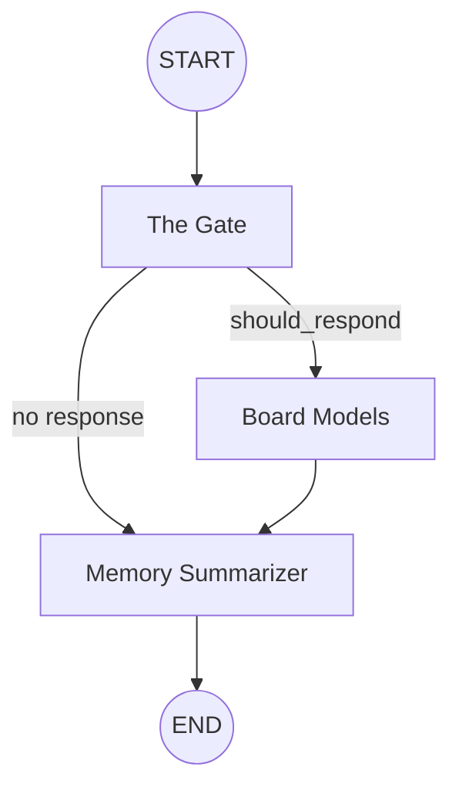

<!-- Badges -->
<p align="center">
  
  
  
  
</p>

<div align="center">

# Kōl

### A Workspace for Synchronized Intelligence

*A group chat where humans and AI models share the same room.*<br/>
*Not a chatbot. Not a tool. A council where intelligence gathered.*

---

**GPT** · **Llama** · **Gemini** · **Kimi** · **Qwen** · **LongCat**

All in one room. All with perspectives. All synchronized.

---

</div>

## 💡 The Vision

Kōl is a **collaborative AI board** where multiple large‑language‑model advisors sit alongside human teammates. The goal is to enable **high‑fidelity, multi‑agent brainstorming** without the noise of endless AI monologues.

> **Why "Kōl"?** The name fuses *coal* (fuel for a fire) with *council*, reflecting a space where many minds generate heat‑driven insight.

---

## 🏛️ Three Core Pillars

### 🎙️ Multi‑Mind Thread (Unified Conversation)
All participants—human or AI—share a single chat thread. Instead of prompting a single model, you host a **board meeting** where each advisor contributes from its specialty.

### ⚓ Contextual Anchoring (Adaptive Memory)
A rolling summarizer compresses the conversation every **10 messages**, keeping the token window flat while preserving the narrative.

### 🧭 Intelligent Routing (The AI Council)
The **Gate** (a fast Llama‑3.3‑70B on Groq) decides *who* should speak, enforcing limits such as **max 3 consecutive AI turns** and **max 2 models per round**.

---

## 🧠 The Brain – LangGraph Orchestration

The AI pipeline is a **state‑graph** built with LangGraph. The flow is:



- **Gate (`gate.ts`)** – reads the last few messages, outputs a `GateDecision` (should_respond, reason, responding_models).
- **Models (`models.ts`)** – sequential execution; each model reads the previous AI output before replying.
- **Summarizer (`summarizer.ts`)** – runs on Llama‑3.1‑8B, compresses history into a third‑person summary injected back into the state.

### Tool Layer
- **Tavily** – real‑time web search for factual data.
- **Jina AI** – URL content extraction for deep‑dive research.

---

## ⚡ Real‑Time Experience (Socket.io)
- **Bi‑directional messaging** with JWT‑handshake authentication.
- **Typing & thinking indicators** (human typing, AI "thinking" with staggered delays of ~3 ms/char).
- **Room‑level socket namespaces** ensure isolated, secure communication per room.

---

## 📁 Project Structure

```text
kol/
├── client/                     # Next.js 16 (App Router)
│   ├── app/                    # Pages & Auth Routes
│   │   ├── (auth)/             # Login & Signup flows
│   │   ├── me/                 # Authenticated Dashboard
│   │   │   ├── friends/        # Social Management
│   │   │   ├── settings/       # User Preferences
│   │   │   └── room/[id]/      # Core Chat Experience
│   │   ├── how-it-works/       # Technical walkthrough page
│   │   ├── about/              # Mission & Vision
│   │   └── invite/[code]/      # Social Onboarding
│   ├── components/             # Reusable UI (Modals, RoomCards, Navbar)
│   ├── hooks/                  # Socket.io & Authentication hooks
│   └── data/                   # Global configuration & constants
│
├── server/                     # Express (Bun)
│   ├── server.ts               # Server entry with Socket.io init
│   ├── socket.ts               # Core socket event handling & AI pipeline execution
│   └── src/
│       ├── agents/             # 🧠 The Brain – LangGraph implementation
│       │   ├── nodes/          # Gate, Models, Summarizer logic
│       │   └── tools/          # Web Search & URL Tools
│       ├── controllers/        # REST route request handlers
│       ├── models/             # Mongoose schemas (User, Room, Message, Invite)
│       └── routes/             # Authentication, Room, and Friend API endpoints
└── README.md
```

---

## ✅ Current State

### Frontend
- Dark‑theme auth flow (login / signup) with username validation and 401 redirects.
- Persistent global sidebar, multi‑page dashboard (`/me`).
- Rich chat UI with AI roster, infinite‑scroll message history, AI‑thinking and typing indicators.
- Room governance UI (`RoomSettingsModal`) for owner‑level actions (add AI, generate invite, remove members).
- Social features: friends list, user search, reciprocal friend addition.

### Backend
- JWT + bcrypt authentication, httpOnly cookie sessions.
- MongoDB persistence for Users, Rooms, Messages, Invites.
- Socket.io server with JWT handshake, automatic room join, and real‑time events.
- Full LangGraph pipeline with automatic summarization every 10 messages.
- Invite code generation (`POST /room/:roomId/invite`) and join flow (`GET /room/invite/:code`).
- Friend API (`GET /friends/list`, `GET /friends/search`, `POST /friends/add`).

---

## 🗺️ Roadmap

| Phase | Status | Milestones |
|---|---|---|
| **Phase 1 – Foundation** | ✅ Completed | Scaffold, auth UI, MongoDB wiring |
| **Phase 2 – The Brain** | ✅ Completed | LangGraph state graph, 6 models across 3 providers |
| **Phase 3 – Real‑time Chat** | ✅ Completed | Socket.io integration, typing & thinking UI |
| **Phase 4 – Social & Governance** | ✅ Completed | Invite system, friend network, room settings |
| **Phase 5 – Tool Layer** | ✅ Completed | Tavily search, Jina URL reader |
| **Phase 6 – Scale** | 🟣 Vision | Credit/usage tracking, premium model integration, React Native client |

---

## 🚀 Setup & Development

### 1. Prerequisites
- **Bun** (recommended) or Node.js ≥ 18
- **MongoDB** (local or Atlas)
- API keys for Groq, LongCat, Gemini, and Tavily (see `.env` below)

### 2. Environment Variables
#### Backend (`server/.env`)
```bash
PORT=8080
MONGODB_URI=mongodb://localhost:27017/kol
JWT_SECRET=your_super_secret_string
FRONTEND_URL=http://localhost:3000

# LLM providers
GROQ_API_KEY=your_groq_api_key
LONGCAT_API_KEY=your_longcat_api_key
GEMINI_API_KEY=your_gemini_api_key

# Agentic tools
TAVILY_API_KEY=your_tavily_api_key
```

#### Frontend (`client/.env.local`)
```bash
NEXT_PUBLIC_BACKEND_URL=http://localhost:8080
NEXT_PUBLIC_FRONTEND_URL=http://localhost:3000
```

### 3. Installation
```bash
# Clone the repo
git clone <repo-url>
cd kol

# Install backend dependencies (Bun)
cd server && bun install

# Install frontend dependencies (Bun)
cd ../client && bun install
```

### 4. Running the Application
Open two terminals:
```bash
# Terminal 1 – Backend
cd server && bun run dev

# Terminal 2 – Frontend
cd client && bun run dev
```
The client runs on `http://localhost:3000`, the server on `http://localhost:8080`.

---

<div align="center">

**Kōl** – Where intelligence gathers.

*Built with obsession. Designed for conversation.*

</div>
