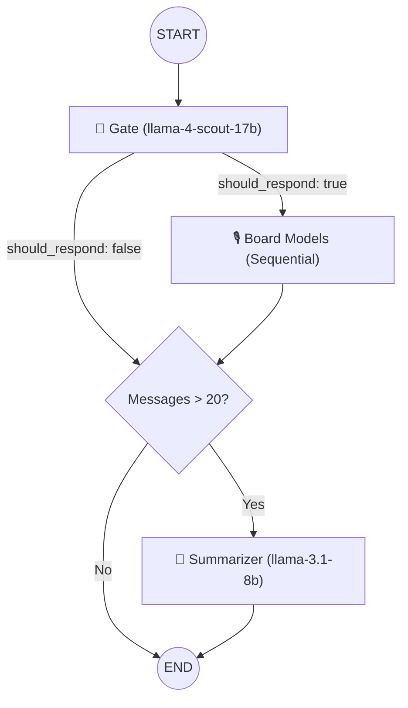

<!-- Badges -->
<p align="center">
  
  
  
  
  
</p>

<div align="center">

# Kōl

### A Workspace for Synchronized Intelligence

*A group chat where humans and AI models share the same room.*<br/>
*Not a chatbot. Not a tool. A council where intelligence gathers.*

---

**GPT** · **Llama** · **Gemini** · **Qwen** · **LongCat**

All in one room. All with perspectives. All synchronized.

---

</div>

## 💡 The Vision

Kōl is a **collaborative AI board** — a real-time group chat where multiple large‑language‑model advisors sit alongside human teammates in shared rooms. Instead of prompting a single AI as a service, you host a **board meeting** where each advisor contributes from its distinct expertise, reads what others have said, and builds on (or challenges) those perspectives.


> **Why "Kōl"?** The name fuses *coal* (fuel for a fire) with *council*, reflecting a space where many minds generate heat‑driven insight.

---

## 🏛️ Three Core Pillars

### 🎙️ Multi‑Mind Thread — Unified Conversation
All participants — human or AI — share a single chat thread. Each AI is a **member** of the group, not a service. They talk naturally, like smart friends in a group chat who happen to have different expertise. Sometimes one answers. Sometimes three jump in. Sometimes nobody says anything because a thumbs‑up doesn't need a response.

### ⚓ Contextual Anchoring — Adaptive Memory
As conversations grow, a background **Living Memory** engine compresses history into a rolling third‑person narrative. This summary is silently injected into every future AI call, keeping the advisors grounded in the room's full history without token bloat. Kōl conversations scale infinitely without losing context.

### 🧭 Intelligent Routing — The AI Council
The **Gate** — a fast moderator model — reads the conversation after every human message and decides which AIs (if any) should respond, and in what speaking order. It enforces strict rules like *no consecutive AI-only monologues* and *mention-based routing* (if you say `@kimi`, only Kimi responds). The result is a group chat that feels alive and natural, not like a round-robin of verbose responses.

---

## 🧠 The Brain — LangGraph Orchestration

The AI pipeline is a compiled **state graph** built with LangGraph. Every message flows through a directed acyclic graph (DAG) after it's sent.



### Node 1: The Gate (`gate.ts`)

The Gate is `meta-llama/llama-4-scout-17b-16e-instruct` running on Groq at near‑zero latency with `temperature: 0` for deterministic decisions. It receives the full conversation history and the list of AI models present in the room, then produces a structured JSON decision:

```ts
// GateDecision Schema (Zod)
{
  should_respond: boolean,   // Whether any AI should respond at all
  reason: string,            // Short explanation (e.g. "User asked @gpt directly")
  responding_models: string[] // Ordered list (e.g. ["kimi", "llama"])
}
```

**Hard Rules the Gate enforces:**
1. Only select models that are actually in the room — never hallucinate.
2. If the last 3 messages are **all from AIs** → `should_respond: false`. Let humans breathe.
3. **STRIKE MENTION RULE**: If a user says `@gpt` or `hey kimi`, *only* that model responds.
4. The model that spoke immediately before **cannot** be selected again in the next round.
5. **EXTREME SELECTIVITY**: Default to exactly ONE model unless the topic explicitly requires diverse perspectives.
6. **REDUNDANCY BAN**: Never pick two models that would give near-identical answers.

**Speaking order matters:** When multiple models are selected, they are ordered so the strongest domain expert speaks first (sets the foundation), complementary perspectives build on it, and the synthesizer/devil's advocate speaks last.

---

### Node 2: The Board (`models.ts`)

When the Gate approves a response, control passes to the model execution layer. Models run **sequentially** — each model's response is added to the conversation before the next model runs, so they can genuinely react to each other like real board members.

Every model has a distinct identity, API configuration, and personality:

| Model ID | LLM | Provider | Personality |
|----------|-----|----------|-------------|
| `gpt` | `openai/gpt-oss-120b` | Groq | The deep thinker — structured reasoning, STEM, logical clarity |
| `llama` | `llama-3.3-70b-versatile` | Groq | The conversationalist — warm, plain language, creative angles |
| `qwen` | `qwen/qwen3-32b` | Groq | The critic — devil's advocate, stress‑tests ideas |
| `gemini` | `gemini-2.5-flash` | Google AI | The generalist — broad knowledge, long‑context synthesis |
| `longcat` | `LongCat-Flash-Chat` | LongCat | The actioner — multi-step plans, practical execution |

**Agentic Tool Access:** Each model has two tools available during reasoning:
- `tavily_search_results_json` — real‑time web search via Tavily API.
- `read_url` — full content extraction from any URL via Jina AI.

Models decide autonomously when to use tools. Tool results are fed back into the model before it composes its final reply.

**Response cleaning pipeline:** After generation, responses are stripped of `<think>` tags, `<tool_call>` blocks, AI‑prefix labels (e.g., `[AI: gpt]:`) and partial multi-speaker contamination.

**Redundancy gate:** If a model produces an empty string after cleaning, it is silently skipped — no error is shown to the user.

---

### Node 3: The Summarizer (`summarizer.ts`)

Runs **conditionally**: triggered when the room has more than 20 unsummarized messages. Uses `llama-3.1-8b-instant` on Groq at `temperature: 0` for consistent, factual compression.

The summarizer takes the first 20 unsummarized messages plus any existing summary and produces a merged, third‑person narrative that:
- Captures key topics, conclusions, decisions, and disagreements.
- Attributes opinions to specific speakers.
- Notes unresolved questions the group plans to revisit.
- Ignores social filler ("thanks", "got it", greetings).
- Stays under **400 words** — ruthlessly concise.

This narrative is stored on the Room document as `room.memory` and injected into every future Gate and Model call. Summarized messages are flagged `isSummarized: true` so they are excluded from the rolling context window.

---

## ⚡ Real‑Time Infrastructure (Socket.io)

Every action in a Kōl room flows through a persistent WebSocket connection. The server lives in `socket.ts`.

### Authentication
All socket connections are authenticated **before** the `connection` event fires. The middleware reads the JWT from either `socket.handshake.auth.token` or the `cookie` header (to support httpOnly browser cookies), verifies it, and attaches `userId` and `username` to the socket instance. Unauthenticated sockets are immediately rejected.

### Socket Events

| Event | Direction | Payload | Description |
|-------|-----------|---------|-------------|
| `join_room` | Client → Server | `{ roomId }` | Verify membership, join Socket.io room, notify others. |
| `leave_room` | Client → Server | `{ roomId }` | Leave socket room, notify others. |
| `send_message` | Client → Server | `{ roomId, content }` | Save human message → broadcast → trigger AI pipeline. |
| `typing_start` | Client ↔ Server | `{ roomId }` / `{ userId, username, type }` | Human started typing. |
| `typing_stop` | Client ↔ Server | `{ roomId }` / `{ userId, username, type }` | Human stopped typing. |
| `receive_message` | Server → Client | `{ _id, roomId, senderName, senderType, modelId?, content, createdAt }` | New message (human or AI). |
| `ai_thinking` | Server → Client | `{ models: string[], status: "thinking" \| "idle" }` | AI pipeline is processing. |
| `user_joined` | Server → Client | `{ userId, username }` | A member joined the socket room. |
| `user_left` | Server → Client | `{ userId, username }` | A member left the socket room. |

### AI Response Flow (after a human message)
1. Human message is persisted to MongoDB (Daily Bucket pattern).
2. Human message is broadcast to the room via `receive_message`.
3. `ai_thinking` is emitted with `status: "thinking"`.
4. The LangGraph pipeline is invoked with the room's context.
5. `ai_thinking` is emitted with `status: "idle"`.
6. For each AI response:
   - `typing_start` emitted with `type: "ai"`.
   - Realistic typing delay: `min(1500ms, 400ms + content.length × 3ms)`.
   - `typing_stop` emitted.
   - AI message persisted to MongoDB.
   - `receive_message` emitted with the AI's response.
   - 300ms pause between consecutive AI responses for natural pacing.
7. If the summarizer ran, `room.memory` is updated and processed messages are flagged.

---

## 📁 Project Structure

```text
kol/
├── client/                          # Next.js 16 (App Router)
│   ├── app/
│   │   ├── page.tsx                 # Public landing page (GSAP animations)
│   │   ├── layout.tsx               # Root layout with global fonts
│   │   ├── globals.css              # Tailwind base + custom CSS
│   │   ├── login/page.tsx           # Login with httpOnly cookie auth
│   │   ├── signup/page.tsx          # Signup with username validation
│   │   ├── invite/[code]/page.tsx   # Invite landing & auto-join flow
│   │   ├── how-it-works/page.tsx    # Technical walkthrough (GSAP)
│   │   ├── about/page.tsx           # Mission & team
│   │   ├── privacy-policy/page.tsx
│   │   ├── terms/page.tsx
│   │   └── me/                      # Authenticated dashboard
│   │       ├── page.tsx             # Room list & creation
│   │       ├── friends/page.tsx     # Friends list & search
│   │       ├── settings/page.tsx    # User preferences
│   │       └── room/[id]/page.tsx   # Core real-time chat experience
│   │
│   ├── components/
│   │   ├── Navbar.tsx               # Top navigation bar
│   │   ├── Sidebar.tsx              # Persistent global sidebar
│   │   ├── RoomCard.tsx             # Room preview card
│   │   ├── CreateRoomModal.tsx      # Room creation form (multi-step)
│   │   ├── RoomSettingsModal.tsx    # Owner governance (invite, remove, delete)
│   │   ├── NotificationModal.tsx    # Global notification system
│   │   └── Footer.tsx
│   │
│   ├── hooks/
│   │   ├── useSocket.ts             # Socket.io connection & event management
│   │   └── useAuth.ts              # Auth state & cookie management
│   │
│   ├── data/
│   │   └── AI_MODELS.ts            # Model metadata: id, name, color, icon
│   │
│   └── proxy.ts                     # Next.js middleware: auth route protection
│
├── server/                          # Express 5 + Bun Runtime
│   ├── server.ts                    # HTTP server + Socket.io bootstrap
│   ├── socket.ts                    # Socket event handlers & AI pipeline trigger
│   └── src/
│       ├── app.ts                   # Express setup & global middleware (CORS, cookies)
│       ├── agents/                  # 🧠 LangGraph AI Orchestration
│       │   ├── index.ts             # Compiled state graph (Gate → Models → Summarizer)
│       │   ├── nodes/
│       │   │   ├── gate.ts          # Moderator — routing decision logic
│       │   │   ├── models.ts        # Board — sequential multi-model execution
│       │   │   └── summarizer.ts    # Memory — rolling conversation compression
│       │   └── tools/
│       │       ├── searchTool.ts    # Tavily web search integration
│       │       └── urlTool.ts       # Jina AI URL reader integration
│       ├── controllers/
│       │   ├── user.controller.ts   # Auth (register, login, me)
│       │   ├── room.controller.ts   # Room CRUD, invites, member governance
│       │   └── friend.controller.ts # Friends list, search, add
│       ├── middlewares/
│       │   └── auth.middleware.ts   # JWT verification for REST routes
│       ├── models/
│       │   ├── user.model.ts        # User (name, email, username, friends, online)
│       │   ├── room.model.ts        # Room (owner, members, aiMembers, memory, messageCount)
│       │   ├── message.model.ts     # DailyChat bucket (roomId, date, messages[])
│       │   └── invite.model.ts      # Invite (code, roomId, 7-day TTL)
│       ├── routes/
│       │   ├── user.route.ts        # POST /auth/register, /auth/login, GET /auth/me
│       │   ├── room.route.ts        # CRUD + invite + governance endpoints
│       │   └── friend.route.ts      # GET /friends/list, /friends/search, POST /friends/add
│       └── lib/
│           └── db.ts                # MongoDB connection utility
│
└── README.md
```

---

## ✅ Current State

### Frontend
- **Auth**: Premium dark-theme login/signup with username format validation (`/^[a-z0-9_]{3,20}$/`), 401 redirect guard, and httpOnly cookie sessions.
- **Middleware**: Next.js `proxy.ts` protects all `/me/*` routes and redirects authenticated users away from auth pages.
- **Dashboard**: Multi-page layout with persistent global sidebar, room list, and `CreateRoomModal`.
- **Chat Room** (`/me/room/[id]`): Real-time chat with infinite scroll, AI roster badges, "thinking" indicator, per-model typing animations, and message persistence.
- **Governance** (`RoomSettingsModal`): Owner-only panel for adding AI advisors, generating invite links, removing human members, and deleting the room.
- **Social** (`/me/friends`): Search users by name or username, add friends (reciprocal), view online status.
- **Invite Flow** (`/invite/[code]`): Smart landing page — unauthenticated users are redirected to signup with the code preserved in state; authenticated users are auto-joined to the room.

### Backend
- **Authentication**: JWT signed tokens stored as httpOnly cookies (7-day expiry). Passwords hashed with bcrypt (salt rounds: 10). Generic "Invalid Email or Password" error prevents user enumeration.
- **Database**: MongoDB with four Mongoose schemas. Messages use a **Daily Bucket** pattern (`DailyChat` documents keyed by `roomId + date`) for efficient pagination and aggregation.
- **Real-time**: Socket.io server with JWT handshake auth (reads from `auth.token` or `cookie` header), room membership verification on `join_room`, and realistic AI typing delays.
- **AI Pipeline**: Full LangGraph state machine with conditional edges, automatic summarization at >20 messages, tool-equipped model nodes, and response sanitization.
- **Governance**: Owner-only invite code generation (cryptographically random 12-char hex), invite join with 7-day TTL, member removal, room deletion, and dynamic AI board modification.
- **Social**: Reciprocal friend addition (one call adds both users to each other's friend list).

---

## 🗺️ Roadmap

| Phase | Status | Milestones |
|-------|--------|------------|
| **Phase 1 – Foundation** | ✅ Completed | Next.js + Express scaffold, auth UI & API, MongoDB wiring |
| **Phase 2 – The Brain** | ✅ Completed | LangGraph state graph, Gate moderator, 6 models across 3 providers |
| **Phase 3 – Real-time Chat** | ✅ Completed | Socket.io integration, typing & AI-thinking indicators, daily-bucket persistence |
| **Phase 4 – Social & Governance** | ✅ Completed | Invite system, friend network, room settings, member removal |
| **Phase 5 – Tool Layer** | ✅ Completed | Tavily web search, Jina AI URL reader, agentic tool loop |
| **Phase 6 – Scale** | 🟣 Planned | Credit/usage tracking, mobile client (React Native), room memory viewer, `@mention` detection UI |

---

## 🚀 Setup & Development

### 1. Prerequisites
- **Bun** (recommended) or Node.js ≥ 18
- **MongoDB** — local instance or [MongoDB Atlas](https://www.mongodb.com/atlas) cluster
- API keys for **Groq**, **LongCat**, **Gemini**, and **Tavily** (see env section below)

### 2. Environment Variables

#### Backend — `server/.env`
```bash
# Server
PORT=8080
MONGODB_URI=mongodb://localhost:27017/kol
JWT_SECRET=your_super_secret_string_min_32_chars
FRONTEND_URL=http://localhost:3000

# LLM Providers
GROQ_API_KEY=your_groq_api_key         # Gate + GPT + Llama + Qwen
LONGCAT_API_KEY=your_longcat_api_key   # LongCat model
GEMINI_API_KEY=your_gemini_api_key     # Gemini 2.5 Flash

# Agentic Tools
TAVILY_API_KEY=your_tavily_api_key     # Web search
```

#### Frontend — `client/.env.local`
```bash
NEXT_PUBLIC_BACKEND_URL=http://localhost:8080
NEXT_PUBLIC_FRONTEND_URL=http://localhost:3000
```

### 3. Installation

```bash
# Clone the repository
git clone https://github.com/m-taqii/kol
cd kol

# Install server dependencies
cd server && bun install

# Install client dependencies
cd ../client && bun install
```

### 4. Running the Application

Open two separate terminals:

```bash
# Terminal 1 — Backend (Express + Socket.io)
cd server && bun run dev

# Terminal 2 — Frontend (Next.js)
cd client && bun run dev
```

- **Frontend** will be available at `http://localhost:3000`
- **Backend API** will be available at `http://localhost:4000`

---

## 🔑 API Keys — Where to Get Them

| Key | Service | Link |
|-----|---------|------|
| `GROQ_API_KEY` | Groq Cloud (free tier available) | [console.groq.com](https://console.groq.com) |
| `GEMINI_API_KEY` | Google AI Studio (free tier available) | [aistudio.google.com](https://aistudio.google.com) |
| `LONGCAT_API_KEY` | LongCat AI | [longcat.chat](https://longcat.chat) |
| `TAVILY_API_KEY` | Tavily Search (free tier available) | [tavily.com](https://tavily.com) |

---

## 🔐 Security Notes

- Passwords are hashed with **bcrypt** (10 salt rounds) before storage.
- JWT tokens are issued with a **7-day expiry** and stored in **httpOnly cookies**, making them inaccessible to JavaScript.
- CORS is configured with `credentials: true` and a strict `origin` whitelist (`FRONTEND_URL`).
- Login errors return a **generic message** ("Invalid Email or Password") regardless of whether the email or password was wrong — preventing user enumeration attacks.
- Socket.io connections require a valid JWT before any event is processed.
- All protected REST routes use `authMiddleware` to verify the JWT from cookies.

---

<div align="center">

**Kōl** — Where intelligence gathers.

*Built with obsession. Designed for conversation.*

</div>
